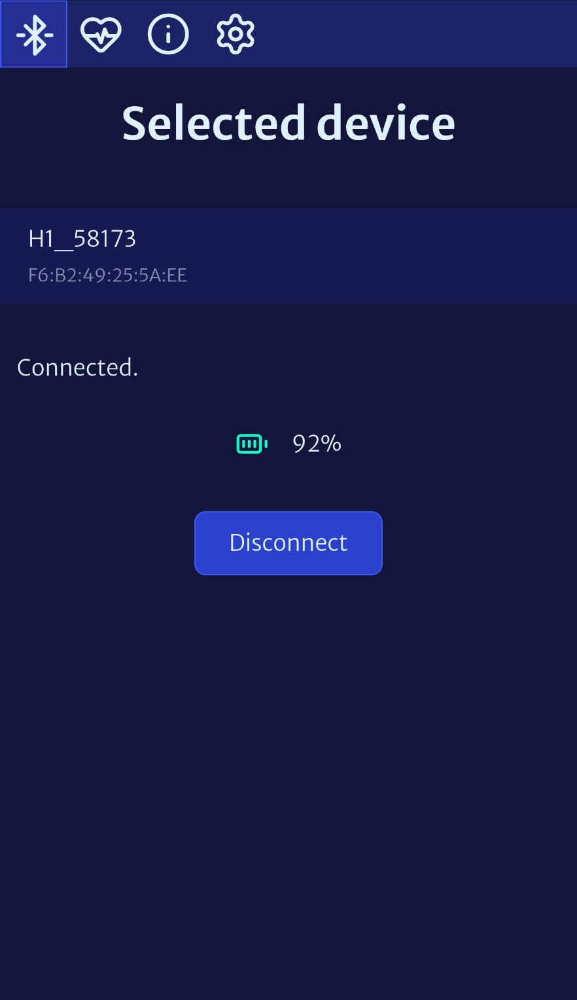
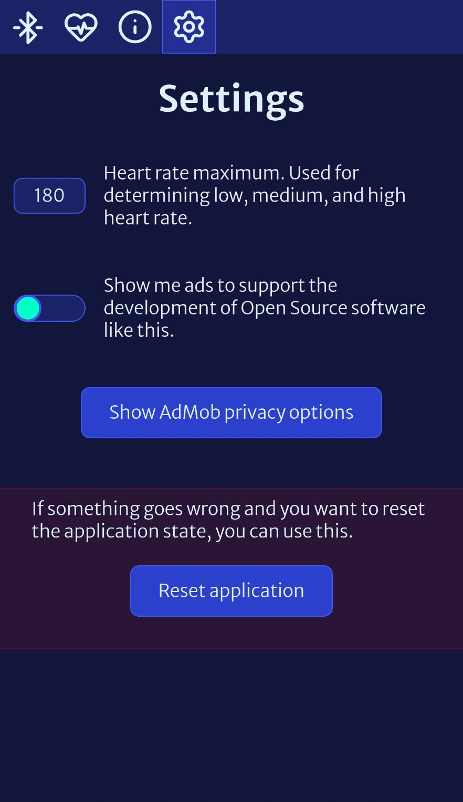
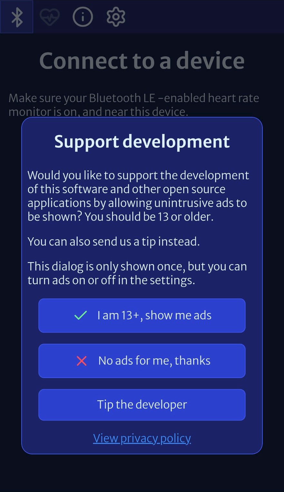

# Open Pulse: BLE heart rate app

Open Source application to connect to your Bluetooth Low Energy heart rate monitor on a mobile device.

Check out [Open Pulse on Google Play](https://play.google.com/store/apps/details?id=ee.cocreators.hrapp)

## Screenshots






## YouTube overview

[](https://www.youtube.com/watch?v=8z4nbk7CLNs)

## Development

### Prerequisites

- [NodeJS 22+](https://nodejs.org/en/download)
- [Bun](https://bun.com/docs/installation)
- [Android SDK](https://developer.android.com/studio) incl. probably `build-tools;35.0.1` and
  `platforms;android-35`
- [pre-commit](https://pre-commit.com/#install)
- Any other [CapacitorJS](https://capacitorjs.com/docs/getting-started/environment-setup) requirements

First, start the dev server

```shell
bun run dev --host
```

Then make sure you have an Android device connected:

```shell
adb devices
```

Then to build and then run on a specific Android device you can use a command like this:

```shell
bun run build && bunx cap sync android && bunx cap run android --live-reload --target YOUR_DEVICE_ID
```

You should then be able to connect to the running application from any Chromium -based browser via
[chrome://inspect/#devices](chrome://inspect/#devices) for debugging and so on.

## Contributing

If you plan on contributing to the code ensure you use [pre-commit](https://pre-commit.com/#install) to
guarantee the code style stays uniform etc.

Also, please open an issue first to discuss the idea before sending a PR so that you know if it would be
wanted or needs re-thinking or if you should just make a fork for yourself.

## License

```
Open Pulse: BLE heart rate monitor
Copyright ©️ 2025  Cocreators OÜ

This program is free software; you can redistribute it and/or
modify it under the terms of the GNU General Public License
as published by the Free Software Foundation; either version 2
of the License, or (at your option) any later version.

This program is distributed in the hope that it will be useful,
but WITHOUT ANY WARRANTY; without even the implied warranty of
MERCHANTABILITY or FITNESS FOR A PARTICULAR PURPOSE.  See the
GNU General Public License for more details.

You should have received a copy of the GNU General Public License
along with this program; if not, see <https://www.gnu.org/licenses/>.
```

Read the full license in the [LICENSE.md](./LICENSE.md) file.

## If I use this it means you own my things, right?

No. You are responsible for and own your own things. This code is licensed under the
[GPL 2.0 license](./LICENSE.md).

# Financial support

This project has been made possible thanks to [Cocreators](https://cocreators.ee) and
[Lietu](https://lietu.net). You can help us continue our open source work by supporting us on
[Buy me a coffee](https://www.buymeacoffee.com/cocreators) .

[](https://www.buymeacoffee.com/cocreators)
